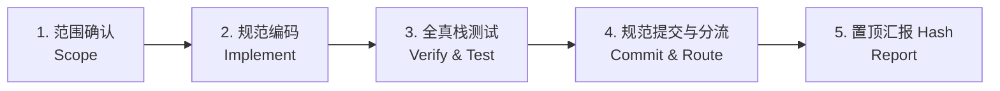

# Agent Workflow SOP & Engineering Standards (AGENTS.md)

> ⚠️ **重要规则 (System Invariable Rule)**：
> 本文件为 Epocanvas Mail 专案的**制度级开发准则、SOP 流程与工程红线**。
> 为防止上下文超载（Context Overflow），本文件**严格保持制度化只读与精简**。
> **绝对禁止**向本文件追加具体的日常任务提交流水、上线清单或审计报告！所有执行记录必须按《文件职能分工与格式化写入指引》分流至对应文件。

---

## 📌 核心准则与提交规范 (Core Rules & Mandatory Standards)

1. **每次开发/重构/修复必须执行完整 Git Commit**:
   - 严禁在工作完成或回合结束时不执行 Commit。
   - 所有任务在通过本地构建、自动化端到端测试与本地全真栈验证后，必须立即执行 `git add` 与 `git commit`。
2. **规范化 Commit Message 与 Hash 追溯**:
   - 提交信息必须结构清晰，说明本次变更的核心背景、架构设计、安全与功能改动。
   - 每次提交后必须将 Commit Hash 完整写入对应的记录文件：
     - **日常开发/重构/修复/部署流水** ➡️ 写入 [CHECKLIST.log](file:///home/shijian/projects/epocanvas-mail/CHECKLIST.log)
     - **系统级全量体检/深度专项审计报告** ➡️ 写入 [REPORTS.md](file:///home/shijian/projects/epocanvas-mail/REPORTS.md)（大型报告正文可存入 `doc/*.md` 并在 `REPORTS.md` 中做索引）
     - **严禁直接写入 `AGENTS.md`**！
3. **向用户明确置顶汇报 Commit Hash**:
   - 在向用户输出回复时，必须在回复最顶端/显式打印出本次提交的完整 Commit Hash 与短 Hash，确保版本可追溯、审计记录完整。
4. **零假数据与测试自动还原准则**:
   - 严禁在数据库或 KV 中硬编码、残留假数据或临时令牌。所有测试用例必须具备 `finally` 自动清理（物理删除）机制。

---

## 🛡️ 工程质量与架构安全红线 (Engineering Redlines)

1. **密钥与凭证安全体系 (Secrets Isolation)**:
   - 生产环境变量（如 `jwt_secret`、`totp_enc_key`）绝对禁止明文提交到任何 git 追踪的 `.toml` 配置文件中。
   - 生产部署通过 `npx wrangler secret put` 安全注入；本地开发通过 `.dev.vars` 承载（已被 `.gitignore` 排除），入库模板维护在 `.dev.vars.example`。
   - 测试脚本一律使用脱敏测试假密钥，严禁在测试代码中硬编码生产真实秘钥。
2. **数据库迁移与冷启动幂等性 (D1 Database & Migrations)**:
   - 数据表字段发生变更时，必须同步维护 `intDB` 的 `CREATE TABLE` 原生定义，并在升级函数（`vX_XDB`）中通过 `PRAGMA table_info` 做条件式检查后执行 `ALTER TABLE ADD COLUMN`，确保幂等性。
   - 全新部署引导链保障：清空 `.wrangler/state` 冷启动后，仅凭访问 `/api/init/<jwt_secret>` 必须能端到端完成所有 6 个标准角色的播种与主站长账号初始化。
3. **多语言 i18n 严格闭环 (Strict Multilingual Symmetry)**:
   - 专案支持 6 种语言（zh, zh-Hant, en, es, fr, nl），所有新增与修改词条必须保持六语言字典 100% 绝对对称。
   - 提交前必须执行静态审计三件套验证：
     - `node scripts/i18n-symmetry.mjs`（6 语言字典键集绝对对称）
     - `node scripts/i18n-audit.mjs`（代码字面量引用零缺失）
     - `node scripts/i18n-hardcoded.mjs`（用户可见文本零未包裹硬编码）
4. **本地全真栈端到端自检保障 (Full-Stack Verification)**:
   - 严禁仅靠修改代码逻辑臆断交付。任何涉及前端 UI 或后端 API 的改动，必须执行构建核验（`mail-vue` 的 `vite build` 与 `mail-worker` 试编译），并在本地运行全真栈进行自动化测试与浏览器回归。

---

## 🔄 标准作业流程 (The 5-Step Workflow SOP)



1. **第 1 步：确认修改范围 (Identify & Fine-tune Scope)**:
   - 明确任务目标与影响边界，识别涉及的后端接口、D1 数据库字段、前端组件、i18n 字典及样式变量。
2. **第 2 步：规范编码与优雅降级 (Implement & Safeguard)**:
   - 遵循既有架构设计，注重暗色模式与移动端适配；
   - 涉及多语言须同步更新 6 语言字典；涉及配置与接口须兼顾降级与缺省防御。
3. **第 3 步：本地全真栈自检与自动化测试 (Self-Inspection & E2E Verification)**:
   - 运行项目构建：确保前端 `vite build` 零警告零报错；
   - 运行回归套件与功能核验脚本；若涉及视觉调整，通过浏览器截图或 Playwright 实际验证；
   - 验证测试数据全部清理，零假数据残留。
4. **第 4 步：规范提交与分流归档 (Commit & Document Routing)**:
   - 执行 `git add` 与 `git commit`，撰写规范详细的 Commit Message；
   - **严格按照文件分工**：将上线核验 Checklist 追加到 `CHECKLIST.log`；若是系统体检/专项审计则写入 `REPORTS.md`；**绝不修改 `AGENTS.md`**。
5. **第 5 步：向用户置顶汇报 Commit Hash (Report)**:
   - 在回复最上方显式输出完整 Commit Hash 与短 Hash，简明扼要汇报验证结果与改动要点。

---

## 📂 文件职能分工与格式化写入指引 (File Routing & Formatting Guide)

为杜绝历史记录将制度文件挤爆、导致 AI 上下文超载，专案建立严格的文档分工体系：

| 文件路径 | 定位与职责 | 写入触发时机 | 维护准则 |
| :--- | :--- | :--- | :--- |
| **`AGENTS.md`** | **制度级 SOP 与工程红线** | 仅当开发规范、SOP 流程、工程底线本身发生制度性变更时 | **严禁追加任何日常任务日志与报告**，长期保持精简（< 200 行） |
| **`CHECKLIST.log`** | **任务执行流水与上线核验清单** | 每次日常功能开发、重构优化、Bug 修复、常规版本部署上线 | 按时间倒序（最新置顶）追加 Checklist 条目 |
| **`REPORTS.md`** | **专项深度审计与系统体检报告** | 执行全量系统体检、UI/安全/i18n 专项深度审计、架构排查 | 按时间倒序（最新置顶）追加标准结构化报告 |
| **`doc/*.md`** | **超长专项分析报告与图表附件** | 报告篇幅极长（如 > 300 行）或包含大量细节矩阵/数据截图 | 在 `doc/` 创建独立文档，并在 `REPORTS.md` 中建立索引链接 |

---

### 📝 `CHECKLIST.log` 写入模板规范

日常开发、修复与功能上线后，在 `CHECKLIST.log` 顶部追加如下格式记录：

```markdown
### <任务简述/特性名称> (<YYYY-MM-DD>)
*   **关联提交 (Git Commit)**: `<完整 Commit Hash>` (Short: `<短 Hash>`)
*   **部署环境 (Deployment)**: `本地全真栈 / 生产 Cloudflare (mail.epocanvas.com)` (Version ID: `<如适用>`)
*   **功能需求与变更清单 (Changes & Feature Alignment)**:
    - [x] 变更点 1：<核心改动与逻辑说明>
    - [x] 变更点 2：<核心改动与逻辑说明>
*   **自动化测试与核验清单 (Verification Checklist)**:
    - [x] 本地构建核验：mail-vue 构建通过 (耗时 X.Xs)
    - [x] 自动化测试套件：`tests/<test-file>.mjs` 全绿 (X/X 断言通过)
    - [x] 浏览器全真栈实测：<UI 或交互实测结果>
    - [x] 零假数据残留：测试临时用户已物理清理 (HTTP 200)
```

---

### 📋 `REPORTS.md` 写入模板规范

执行系统体检、专项深度审计、架构或安全扫描后，在 `REPORTS.md` 顶部追加如下格式记录：

```markdown
### <体检/审计专项名称> (<YYYY-MM-DD>)
*   **关联提交 (Git Commit)**: `<完整 Commit Hash>` (Short: `<短 Hash>`)
*   **专项文档索引 (Detailed Doc)**: `doc/<audit-file>.md` (若有独立文档)
*   **体检/审计范围与方法 (Scope & Methodology)**:
    1. 范围与环境：<全真栈/生产环境、覆盖模块与设备分辨率>
    2. 工具与脚本：<静态扫描三件套/自动化测试脚本/全仓扫描工具>
*   **核心发现与缺陷矩阵 (Key Findings & Matrix)**:
    - **[P0·阻塞/安全]**: <致命缺陷、安全隐患或阻断性错误及根因>
    - **[P1·重要/体验]**: <重大体验问题、功能缺失或性能卡点>
    - **[P2·次要/样式]**: <视觉样式偏差、次要提示文案、非阻断性隐患>
*   **治理修复与回归结果 (Fixes & Verification)**:
    - <关键修复落地动作与自动化/端到端实测验证结果>
    - <通过项清单与后续优化路线图 (Roadmap)>
```
